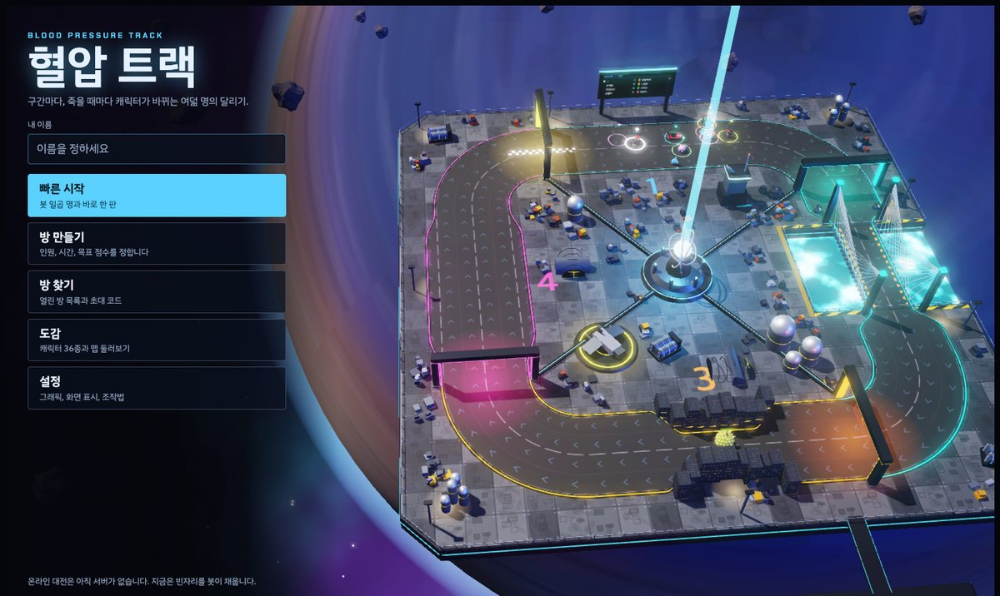
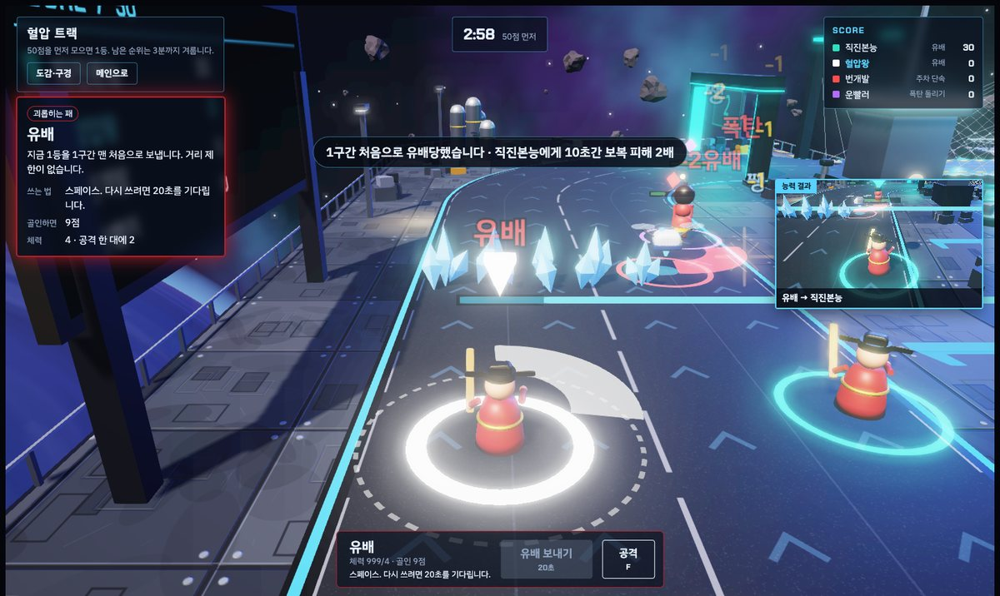
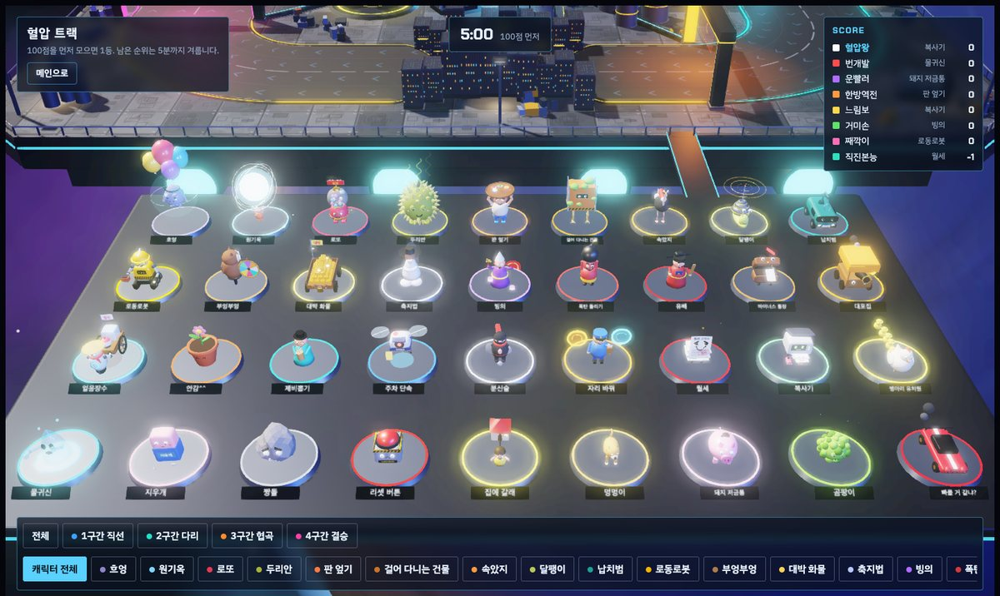

# 혈압 트랙

구간마다, 죽을 때마다 캐릭터가 바뀌는 여덟 명의 3D 달리기 게임입니다.
스타크래프트 유즈맵 "혈압마라톤"을 웹으로 옮긴 팬 리메이크이고, 브라우저 하나로 봇 일곱과 겨룰 수 있습니다.




## 지금 되는 것과 안 되는 것

| 항목 | 상태 |
|---|---|
| 봇 일곱과 한 판 (5분, 100점) | 됨 |
| 캐릭터 35종, 체력·공격·죽음·보복 | 됨 |
| 방 설정 (인원, 시간, 목표 점수) | 됨. 빈자리는 봇이 채움 |
| 골인 뒤 관전, 최종 순위표 | 됨 |
| 다른 사람과 온라인 대전 | **안 됨.** 서버가 아직 없음 |
| 초대 코드, 방 찾기 | 화면만 있음 |
| 소리 | 없음 |

## 실행

Node 20 이상이 필요합니다.

```bash
npm install
npm run dev        # http://localhost:5173
```

화면은 three.js r128을 CDN에서 불러오므로 인터넷이 연결돼 있어야 합니다.

| 명령 | 하는 일 |
|---|---|
| `npm run dev` | 개발용 서버를 띄웁니다. 포트를 바꾸려면 `npm run dev -- 8080` |
| `npm test` | 계산 모듈만으로 여러 판을 끝까지 돌려 봅니다. 브라우저가 필요 없습니다 |
| `npm run test:e2e` | 크롬을 화면 없이 띄워 메뉴부터 판이 끝날 때까지 눌러 봅니다 |
| `npm run build` | 한 장짜리 페이지 `dist/index.html`을 만듭니다. 아무 정적 호스팅에나 올리면 됩니다 |
| `npm run docs:characters` | 이 문서의 캐릭터 표를 캐릭터 자료에서 다시 만듭니다 |
| `node scripts/bench.mjs` | 방 하나가 쓰는 CPU를 잽니다. 서버 수용 인원 추정의 바탕입니다 |

`npm run test:e2e`는 맥의 크롬 경로를 기본으로 씁니다. 다른 곳에 있으면 `CHROME=/경로/chrome npm run test:e2e`로 알려 주세요.

## 조작

| 동작 | 키보드 | 터치 화면 |
|---|---|---|
| 이동 | W A S D 또는 방향키 | 왼쪽 조이스틱 |
| 능력 | 스페이스 | 능력 버튼 |
| 공격 | F | 공격 버튼 |
| 시점 돌리기 | 마우스로 화면 끌기 | 화면 끌기 |
| 시점 거리 | 휠 | |
| 시점 되돌리기 | 화면 두 번 누르기 | 화면 두 번 누르기 |
| 골인 뒤 관전 대상 바꾸기 | A, D | 이전, 다음 버튼 |

시점을 돌려도 이동 방향은 그대로입니다. W는 언제나 트랙이 가는 쪽입니다.

## 규칙

- 트랙을 한 바퀴 돌아 결승선에 들어가면 그때 몰던 캐릭터에 따라 점수를 받습니다. 점수가 깎이거나 0이 되는 꽝도 있습니다.
- 구간 문을 지날 때마다, 그리고 죽을 때마다 캐릭터가 무작위로 바뀝니다. 꽝이 걸렸다면 죽는 것이 살 길입니다.
- 캐릭터마다 체력이 있고 F로 공격합니다. 공격은 캐릭터가 보는 쪽으로 나가고, 방식은 캐릭터마다 다릅니다. 나를 건드린 사람에게는 10초간 피해가 두 배입니다.
- 목표 점수를 먼저 채우면 순위를 받고 트랙에서 빠집니다. 남은 사람은 시간이 다 될 때까지 계속 겨룹니다.

맵은 넓은 사각 순환이고, 구간마다 한 군데씩 좁아집니다.

| 구간 | 병목 |
|---|---|
| 1구간 | 수정 벽. 부숴야 지나가고 25초 뒤 다시 자랍니다 |
| 2구간 | 난간 없는 다리. 밀려서 가장자리를 넘으면 떨어져 죽습니다 |
| 3구간 | 두 명이 겨우 지나가는 협곡. 차단벽이 가운데를 막습니다. 부수면 열리고 12초 뒤 다시 닫힙니다 |
| 4구간 | 가장 넓은 마지막 직선 |

## 캐릭터

누가 무엇을 몰게 될지는 완전히 무작위입니다. 등수가 낮다고 좋은 캐릭터가 더 잘 나오지 않습니다. 원작도 그렇습니다.
다만 흐엉, 대박 화물, 원기옥, 판 엎기, 안감^^은 다른 캐릭터의 절반쯤으로 드물게 나오고, 대박 화물은 4구간에서만 나옵니다.

공격 방식은 여섯 가지입니다. 바닥의 테두리가 닿는 범위이고, 붉게 변하면 맞을 상대가 있다는 뜻입니다.

| 방식 | 범위 | 특징 |
|---|---|---|
| 할퀴기 | 앞쪽 짧은 부채꼴 | 약하고 빠릅니다 |
| 내려치기 | 몸 주변의 작은 원 | 한 명을 크게 밀어냅니다 |
| 쏘기 | 앞으로 긴 직선 | 처음 닿는 것이 맞습니다 |
| 저격 | 아주 긴 직선 | 조준선이 먼저 뜨고 조금 뒤에 나갑니다 |
| 던지기 | 앞쪽 떨어진 곳의 원 | 떨어진 자리의 모두가 맞습니다. 가까이는 못 칩니다 |
| 터뜨리기 | 몸 주변의 넓은 원 | 예고가 뜬 뒤 범위 안의 모두가 맞습니다 |

게임 안의 도감에서 모델을 돌려 보며 같은 설명을 읽을 수 있습니다.



<!-- characters:start -->
### 괴롭히는 패 (6)

남을 멈추거나 끌어내립니다.

| 캐릭터 | 능력 | 쓰는 법 | 상대하는 법 | 골인하면 | 몸 |
|---|---|---|---|---|---|
| **납치범** | 가까운 캐릭터를 태우고 달립니다. 다리 위에서 내리면 떨어져 죽고, 결승선을 같이 넘으면 태운 사람도 골인합니다. | 스페이스로 태우고, 다시 눌러 내립니다. 6초가 지나면 저절로 내립니다. | 납치범이 죽으면 풀려납니다. | 8점 | 체력 6 · 내려치기 1 |
| **달팽이** | 지금 1등을 5초간 느리게 합니다. 지나간 자리에는 점액이 남아 밟으면 느려집니다. | 스페이스. 점액은 저절로 남습니다. | 점액이 없는 줄로 피해 가세요. | 7점 | 체력 3 · 공격 못 함 |
| **빙의** | 가까운 상대의 몸을 8초간 빼앗아 대신 조종합니다. 그 몸으로 골인하면 점수는 내가 받습니다. 그 몸의 능력도 내가 씁니다. | 스페이스. 그동안 내 원래 몸은 그 자리에 서 있어서 맞을 수 있습니다. | 서 있는 무당의 몸을 치세요. 죽으면 풀립니다. | 6점 | 체력 3 · 쏘기 1 |
| **얼음장수** | 앞쪽 넓은 범위를 5초간 얼립니다. 언 사람은 깨지지 않는 얼음덩어리가 되어 길까지 막습니다. | 스페이스. 내 앞 9칸 지점이 중심입니다. | 얼어 있는 동안은 맞지 않습니다. 풀리면 10초간 보복 피해가 2배입니다. | 18점 | 체력 3 · 쏘기 1 |
| **유배** | 지금 1등을 1구간 맨 처음으로 보냅니다. 거리 제한이 없습니다. | 스페이스. 다시 쓰려면 20초를 기다립니다. | 1등이 아니면 안 맞습니다. 흐엉에게는 안 통합니다. | 9점 | 체력 4 · 내려치기 2 |
| **주차 단속** | 앞에 있는 바퀴 달린 캐릭터 하나를 12초간 세웁니다. 세워진 사람은 맞아도 피하지 못합니다. | 스페이스. 얼음장수, 납치범, 스포츠카, 로동로봇, 대박 화물에게만 통합니다. 공격은 멀리까지 닿는 저격입니다. | 바퀴가 없는 캐릭터에게는 안 통합니다. 붉은 조준선이 보이면 옆으로 비키세요. | 17점 | 체력 3 · 저격 2 |

### 움직이는 패 (2)

내 자리를 바꿉니다.

| 캐릭터 | 능력 | 쓰는 법 | 상대하는 법 | 골인하면 | 몸 |
|---|---|---|---|---|---|
| **자리 바꿔** | 앞사람과 자리를 맞바꿉니다. 체력이 1이라 한 대 맞으면 죽습니다. | 스페이스. 내 앞에서 가장 가까운 사람이 대상입니다. | 한 대만 치면 됩니다. | 6점 | 체력 1 · 공격 못 함 |
| **축지법** | 앞으로 순간이동합니다. 사람과 장애물을 통과합니다. | 스페이스. 2.5초마다 쓸 수 있습니다. | 체력이 낮습니다. 도착한 자리에서 치세요. | 5점 | 체력 2 · 쏘기 1 |

### 뒤섞는 패 (5)

누가 무엇을 모는지를 바꿉니다.

| 캐릭터 | 능력 | 쓰는 법 | 상대하는 법 | 골인하면 | 몸 |
|---|---|---|---|---|---|
| **곰팡이** | 남이 지은 가건물이나 포탑에 붙으면 걸어 다니는 건물이 됩니다. 그 건물로 골인하면 78점입니다. | 설치물 가까이에서 스페이스. 로동로봇이나 대포집이 있어야 쓸 수 있습니다. | 설치물을 미리 부수거나, 걸어 다니는 건물을 잡으세요. | 2점 | 체력 2 · 공격 못 함 |
| **복사기** | 가장 가까운 상대와 같은 캐릭터가 됩니다. | 스페이스. 좋은 패를 든 사람 옆에서 쓰세요. | 꽝을 들고 옆에 붙으면 꽝을 복사해 갑니다. | 6점 | 체력 3 · 쏘기 1 |
| **분신술** | 가짜 셋을 만듭니다. 가짜는 길을 막고, 나를 노린 능력을 대신 맞아 줍니다. | 스페이스. 가짜는 10초 뒤 사라집니다. | 가짜는 한 대 맞으면 터집니다. | 6점 | 체력 2 · 할퀴기 1 |
| **속았지** | 버튼에는 가속이라고 쓰여 있지만, 누르면 5초간 땅에 머리를 박고 못 움직입니다. 대신 그동안은 아무것도 안 맞습니다. | 스페이스. 얼음이나 폭탄을 피할 때만 쓰세요. | 머리를 뺄 때까지 기다렸다가 치세요. | 5점 | 체력 3 · 할퀴기 1 |
| **제비뽑기** | 앞사람의 캐릭터를 강제로 다시 뽑게 합니다. 좋은 패를 든 사람에게는 날벼락이고, 꽝을 든 사람에게는 구원입니다. | 스페이스. 내 앞에서 가장 가까운 사람이 대상입니다. | 꽝을 들었다면 제비뽑기 앞에 서 있으세요. | 6점 | 체력 3 · 내려치기 1 |

### 설치하는 패 (3)

길 위에 무언가를 남깁니다.

| 캐릭터 | 능력 | 쓰는 법 | 상대하는 법 | 골인하면 | 몸 |
|---|---|---|---|---|---|
| **대포집** | 포탑을 깝니다. 포탑은 25초 동안 지나가는 사람을 쏘고 길도 막습니다. 체력 낮은 캐릭터는 포탑밭을 못 지나갑니다. | 스페이스. 내 뒤에 놓입니다. 좁은 길에 여러 개 까세요. | 포탑을 공격해 부수세요. 체력은 4입니다. | 4점 | 체력 5 · 던지기 1 |
| **로동로봇** | 가건물을 짓습니다. 길을 막고, 20초 동안 부서지지 않으면 30점을 받습니다. 캐릭터가 바뀌어도 점수는 지은 사람이 받습니다. | 스페이스. 내 바로 뒤에 지어집니다. 공격은 설치물과 장애물에 두 배로 들어가서 수정 벽과 차단벽을 빨리 엽니다. | 가건물을 공격해 부수세요. | 2점 | 체력 5 · 내려치기 2 |
| **폭탄 돌리기** | 가까운 사람에게 5초짜리 폭탄을 붙입니다. 폭탄은 몸이 닿으면 옮겨갑니다. 터지면 든 사람이 죽고 주변도 다칩니다. | 스페이스. 근처에 아무도 없으면 내가 들게 되니 얼른 남에게 비비세요. | 폭탄이 붙으면 다른 사람에게 몸을 비비세요. | 5점 | 체력 3 · 던지기 1 |

### 점수를 흔드는 패 (9)

골인했을 때 판이 크게 움직입니다.

| 캐릭터 | 능력 | 쓰는 법 | 상대하는 법 | 골인하면 | 몸 |
|---|---|---|---|---|---|
| **걸어 다니는 건물** | 곰팡이가 설치물에 붙어 생깁니다. 느리지만 골인하면 78점입니다. | 뽑아서 나오지는 않습니다. 맞지 않게 조심해서 가세요. | 여럿이 달려들어 잡으세요. 체력은 8입니다. | 78점 | 체력 8 · 공격 못 함 |
| **대박 화물** | 골인하면 90점입니다. 4구간에서만 나오고, 체력이 1이라 한 대 맞으면 끝입니다. | 아무도 모르게 가세요. | 한 대만 치면 됩니다. | 90점 | 체력 1 · 공격 못 함 |
| **로또** | 골인할 때 추첨합니다. 0점에서 78점 사이가 더해지지만, 일곱 번에 한 번은 내 점수가 0이 됩니다. | 골인하세요. | 골인하기 전에 죽이면 됩니다. | 0 ~ 78점, 또는 0점으로 | 체력 3 · 쏘기 1 |
| **물귀신** | 골인할 때 가까이 있던 사람도 같이 7점이 깎입니다. | 사람들 곁에 붙어서 골인하세요. | 물귀신이 결승선에 다가가면 멀리 떨어지세요. | 나와 곁에 있던 전원 -7점 | 체력 2 · 할퀴기 1 |
| **병아리 유치원** | 병아리를 한 마리씩 앞으로 내보냅니다. 병아리가 결승선을 넘으면 2점입니다. 누구에게든 부딪히면 죽습니다. | 스페이스. 병아리는 다섯 마리입니다. 길이 뚫렸을 때 보내세요. | 병아리 앞을 가로막으세요. | 남은 병아리 한 마리당 1점 | 체력 3 · 던지기 1 |
| **부엉부엉** | 룰렛을 돌려 한 명을 죽입니다. 나도 걸릴 수 있습니다. | 스페이스. | 운입니다. | 6점 | 체력 3 · 할퀴기 1 |
| **원기옥** | 6초 동안 기를 모은 뒤 터뜨리면 나만 빼고 모두 죽습니다. 가건물도 부서집니다. | 스페이스. 모으는 동안 죽으면 끝입니다. | 모으는 동안 치세요. 체력이 낮습니다. | 없음 | 체력 2 · 공격 못 함 |
| **지우개** | 닿은 캐릭터를 지웁니다. 지워진 사람은 죽은 것으로 칩니다. | 몸으로 들이받으세요. | 닿지 않게 떨어져서 치세요. | 내 점수가 8점으로 고정 | 체력 3 · 공격 못 함 |
| **판 엎기** | 골인하면 모든 사람의 점수가 0이 됩니다. | 지고 있으면 골인하고, 이기고 있으면 죽어서 바꾸세요. | 골인하기 전에 죽이세요. | 전원 0점 | 체력 4 · 쏘기 1 |

### 꽝 (10)

걸리면 손해입니다. 죽어서 바꾸는 것이 살 길입니다.

| 캐릭터 | 능력 | 쓰는 법 | 상대하는 법 | 골인하면 | 몸 |
|---|---|---|---|---|---|
| **돼지 저금통** | 단단하고 느리고 아무것도 못 합니다. 능력 키를 30번 누르면 스스로 깨져서 다른 캐릭터가 됩니다. 흩어진 동전은 줍는 사람이 1점씩 가져갑니다. | 스페이스를 30번 연타하세요. | 깨질 때 옆에 있다가 동전을 주우세요. | 1점 | 체력 12 · 공격 못 함 |
| **리셋 버튼** | 골인하면 내 점수가 0이 됩니다. 4구간에서는 결승선으로 끌려갑니다. | 4구간에 들어가기 전에 누군가에게 맞아 죽는 것이 살 길입니다. | 죽여주지 않으면 됩니다. | 내 점수 0점 | 체력 6 · 공격 못 함 |
| **마이너스 통장** | 골인하면 10점이 깎입니다. 4구간에서는 결승선으로 끌려갑니다. | 4구간에 들어가기 전에 누군가에게 맞아 죽는 것이 살 길입니다. | 죽여주지 않으면 됩니다. | -10점 | 체력 3 · 공격 못 함 |
| **멍멍이** | 골인하면 35점이지만 말을 잘 안 듣습니다. 가만두면 제멋대로 돌아다니고, 조종해도 옆으로 샙니다. | 계속 방향을 잡아 주세요. 손을 떼면 뒤로도 갑니다. | 체력이 2뿐입니다. | 35점 | 체력 2 · 할퀴기 1 |
| **빠를 거 같냐?** | 생긴 것과 달리 느립니다. 장애물에 부딪히면 끼어서 못 움직입니다. | 끼면 A와 D를 번갈아 네 번 누르세요. | 앞에 장애물을 두면 끼입니다. | 3점 | 체력 4 · 쏘기 1 |
| **안감^^** | 못 움직입니다. 누가 가까이 오면 저절로 주변을 터뜨리고, 맞은 사람은 5초간 더 아프게 맞습니다. 죽어야 바뀝니다. | 기다리세요. 30초가 지나면 저절로 바뀝니다. | 멀리 돌아가거나, 죽이지 말고 그냥 두세요. | 없음 | 체력 3 · 터뜨리기 2 |
| **월세** | 살아 있는 동안 2초마다 1점씩 깎입니다. 공격도 못 합니다. | 빨리 골인하거나, 누가 죽여주길 기다리세요. | 굳이 죽여주지 마세요. | 0점 | 체력 4 · 공격 못 함 |
| **집에 갈래** | 고무줄이 계속 뒤로 잡아당깁니다. 가만히 있으면 뒤로 끌려갑니다. | 앞으로 가는 키를 누르고 있지 말고 연타하세요. | 내버려 두면 알아서 뒤로 갑니다. | 6점 | 체력 3 · 공격 못 함 |
| **짱돌** | 몸 주변의 모두를 한 번에 죽입니다. 하지만 엄청 느리고 체력이 1입니다. | F를 누르면 붉은 원이 뜨고 조금 뒤에 터집니다. | 붉은 원이 보이면 밖으로 나가세요. 멀리서 쏘면 한 방입니다. | 4점 | 체력 1 · 터뜨리기 즉사 |
| **흐엉** | 가장 느리고, 골인하면 15점을 잃습니다. 무적이라 맞아 죽어서 바꿀 수도 없습니다. | 다음 구간 문까지 가면 바뀝니다. 4구간에서 걸렸다면 결승선을 넘는 수밖에 없습니다. | 건드릴 수 없고, 건드릴 이유도 없습니다. 느려서 길을 막으니 비켜 가세요. | -15점 | 무적 · 공격 못 함 |
<!-- characters:end -->

이 표는 `src/sim/characters.js`에서 만들어집니다. 캐릭터를 고쳤다면 `npm run docs:characters`로 다시 만드세요.

## 구조

계산과 화면을 갈라 두었습니다. 나중에 계산을 서버에서 돌리기 위해서입니다.

```
index.html            페이지 뼈대
styles.css            화면 구석의 표시와 메인 화면의 모양
src/
  main.js             들어오는 문
  app.js              계산과 화면을 잇는 곳: 한 프레임, 입력, 버튼, 알림, 메뉴
  sim/                계산. 숫자와 규칙만 다룬다
    track.js          길의 모양과 폭
    characters.js     캐릭터 표, 점수, 확률
    game.js           한 판: 상태, 한 걸음(step), 능력, 봇, 순위
  view/               화면. three.js로 그린다
    renderer.js       캔버스와 WebGL
    tools.js          색, 재질, 도형을 만드는 도구
    world.js          하늘, 갑판, 길, 다리, 협곡, 문, 설비
    models.js         캐릭터 모델과 동작
    stage.js          선수, 설치물, 효과, 전광판을 계산의 상태대로 그리기
    screen.js         후처리, 작은 결과 화면, 카메라, 도감 카드
scripts/              개발용 서버와 묶기
test/                 계산 시험 (node:test)
e2e/                  브라우저 시험
```

### 한 프레임이 도는 순서

```
키와 조이스틱 ─▶ app.js ─▶ game.step(dt, 입력) ─▶ 상태가 바뀌고 사건이 쌓임
                                                      │
              화면 구석 표시 ◀─ app.js ◀─ 사건 ────────┤
              three.js 장면 ◀─ stage.sync() ◀─ 상태 ───┘
```

- **상태:** `game.units`, `game.turrets`처럼 지금 판이 어떤 모습인지를 담은 값입니다. 화면은 매 프레임 이것을 읽어 그립니다.
- **사건:** `game.events`에 쌓이는, 방금 일어난 일입니다. 팝업, 알림, 휘두른 자국처럼 한 번 보여주고 끝나는 것들입니다. 숫자와 글자만 담으므로 그대로 네트워크로 보낼 수 있습니다.

### 지켜야 할 경계

`src/sim/` 안의 코드는 `document`, `window`, `THREE`를 쓰지 않습니다. `npm test`가 이 폴더만으로 Node에서 한 판을 끝까지 돌리므로, 경계를 넘으면 시험이 깨집니다. 반대로 `src/view/`는 규칙을 바꾸지 않고 상태를 읽기만 합니다.

`createGame({ random })`에 난수 함수를 넘기면 같은 씨앗과 같은 입력에서 같은 판이 나옵니다. 시험이 이것을 씁니다.

### 사건의 종류

| 사건 | 뜻 | 받는 쪽 |
|---|---|---|
| `popup` | 머리 위에 뜨는 글자 | stage |
| `burst`, `swing`, `zap`, `pulse` | 맞은 섬광, 휘두른 자국, 포탑의 빛줄기, 얼음 고리 | stage |
| `respawn` | 출발점으로 돌아감 | stage |
| `toast` | 한 사람에게만 보이는 알림 | app |
| `pip` | 능력 결과를 작은 화면으로 보여 달라는 요청 | app |
| `become`, `ride` | 캐릭터가 바뀜, 빙의가 시작되거나 끝남 | app |
| `finish`, `over` | 누군가 순위를 받음, 판이 끝남 | app |

## 서버를 붙일 때

아직 만들지 않았습니다. 방향만 정해 두었습니다.

- 서버가 방마다 `createGame()`을 하나씩 돌리고, 접속한 사람의 입력을 `game.step()`에 넘깁니다.
- 브라우저는 입력을 보내고 상태와 사건을 받아 그리기만 합니다. `app.js`에서 `game`을 만드는 자리에 서버의 상태를 받아 오는 것이 들어갑니다.
- 방장의 브라우저가 계산하는 방식은 쓰지 않기로 했습니다. 이유는 [결정 0002](docs/decisions/0002-server-runs-the-match.md)에 있습니다.

바꿔야 할 것이 하나 남아 있습니다. 상태 안에서 선수끼리 서로를 직접 가리키는 곳(`grudge`, `carriedBy`, `owner` 등)은 네트워크로 보내기 전에 번호로 바꿔야 합니다.

## 비밀 값

지금 이 저장소에는 키도 토큰도 없고, 필요로 하는 것도 없습니다. 서버가 생겨 비밀 값이 필요해지면 이렇게 다룹니다.

- 값은 `.env`나 서버의 환경 변수에만 둡니다. `.gitignore`가 `.env`, `.env.*`, `*.pem`, `*.key`, `credentials*.json`을 막고 있습니다.
- 어떤 값이 필요한지는 값 없이 이름만 적은 `.env.example`로 알립니다.
- 브라우저로 가는 코드(`src/`, `index.html`)에는 비밀 값을 넣지 않습니다. 묶은 파일은 누구나 열어 볼 수 있습니다.
- 실수로 올렸다면 지우는 것으로 끝내지 말고 그 키를 바로 폐기하고 새로 받습니다. 깃 기록에는 남기 때문입니다.

## 문서

| 문서 | 내용 |
|---|---|
| [AGENTS.md](AGENTS.md) | 이 저장소에서 일하기 전에 읽는 한 장. 명령, 넘으면 안 되는 경계, 지켜야 할 것 |
| [docs/decisions/](docs/decisions/README.md) | 무엇을 정했고 왜 그렇게 정했는지. 버린 안과 버린 이유 |
| [docs/direction.md](docs/direction.md) | 다음에 할 것, 하지 않기로 한 것, 아직 못 정한 것 |
| [docs/design/characters.md](docs/design/characters.md) | 캐릭터를 만드는 원칙, 아직 안 만든 16종, 알려진 문제 |
| [docs/research/](docs/research/) | 결정의 근거: 원작 맵 실측, 원작의 뽑기 확률, 서버 수용 인원 추정 |

## 함께 일하는 규칙

- 브랜치: `main`은 배포되는 것, `develop`은 다음에 나갈 것. 작업은 `feat/이슈번호-설명`처럼 갈라서 합니다.
- 커밋 메시지: `type: 내용`. type은 `feat`, `fix`, `chore`, `docs`, `refactor`, `test`, `style`, `perf`, `build`, `ci` 가운데 하나이고 내용은 한글로 짧게 씁니다. 이슈가 있으면 끝에 `(#번호)`를 붙입니다.

## 출처

- 원작은 스타크래프트 유즈맵 "혈압마라톤"입니다. 원작 제작자는 Birth.Buzz로 알려져 있습니다. 이 저장소는 원작의 규칙과 분위기를 참고해 새로 만든 것이고, 원작의 파일이나 그림은 들어 있지 않습니다.
- 맵의 폭과 구성은 [scmscx.com에 올라온 999만바퀴 Victory13 판](https://scmscx.com/map/zqD5qkyr)을 재서 정했습니다.
- 캐릭터 모델과 맵은 전부 코드로 만든 도형입니다. 그림 파일이나 3D 모델 파일을 쓰지 않습니다.
- 화면은 [three.js](https://threejs.org/) r128로 그립니다.

라이선스는 아직 정하지 않았습니다.
